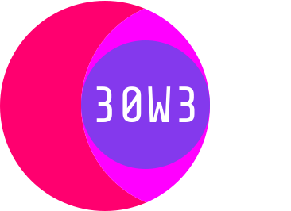
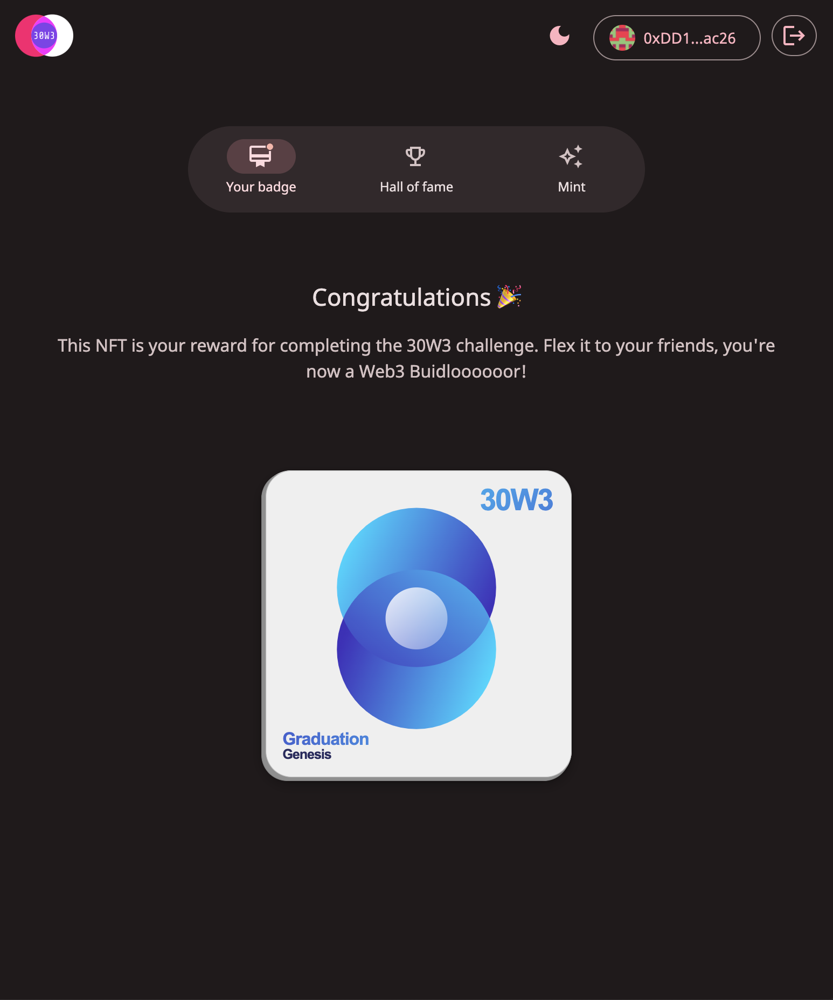
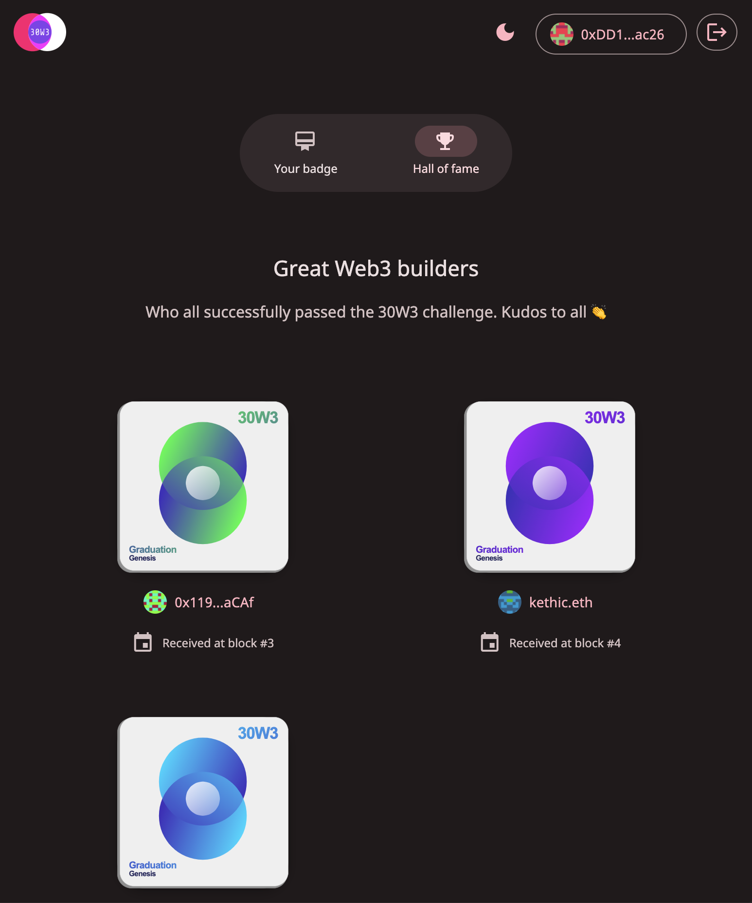
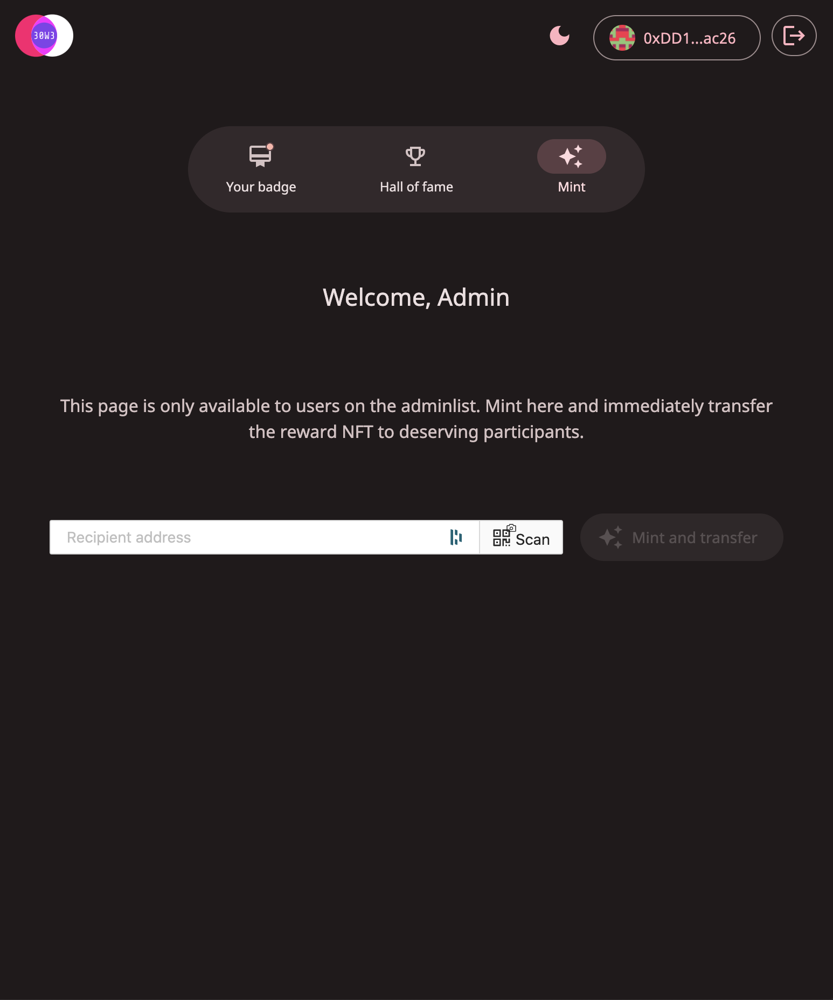
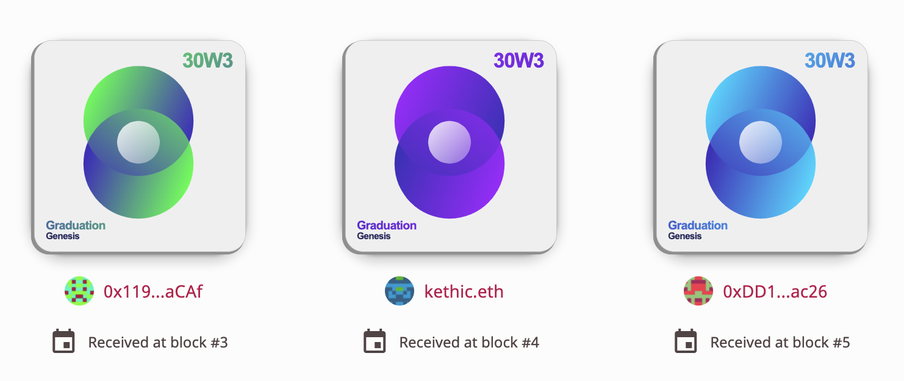

# 30-Days of Web3.0 ⚒️

<div width="100%" style="display: flex; justify-content: center; margin: 3rem;">
    
    </a>
</div>

A Web3 Dapp deployed on **Optimistic Ethereum** to mint, transfer and explore NFT rewards for the participants of **30-Days of Web3.0**. https://absorbing-title.surge.sh 👀

## About 30-Days of Web3.0

It's a hackathon, and an opportunity to work with your peers, ship a project, and gain hands-on Web3 experience in small, collaborative, focused cohorts. [🐦 See on Twitter](https://twitter.com/wslyvh/status/1472955969151848456?s=20&t=wyKcY1i61E7gKqr6kwS7Ow).

📅 **Cohort #0**, named **Genesis**, spanned over **4 weeks** in **Januaray 2022**.

## The Dapp

This repository contains the work of one team of the Genesis cohort, composed of [@kethcode](https://github.com/kethcode), [@xavierbrochard](https://github.com/xavierbrochard), and [@Larkef](https://github.com/Larkef).

We built [this decentralized application](https://absorbing-title.surge.sh) (Solidity smart contracts + frontend + NFT artwork), and deployed it on the **Optimistic Ethereum** blockchain. This Dapp lets the hackathon's admins mint and distribute NFT rewards to all hackathons participants. It also includes a hall of fame to explore all NFTs minted this way.

## Smart contracts

The main Solidity smart contract is [`./packages/hardhat/contracts/NFT30Web3.sol`](./packages/hardhat/contracts/NFT30Web3.sol). It extends [this generic ERC721 token smart contract](./packages/hardhat/contracts/ERC721_Solmate_Hooked.sol).

The method `mint` mints and transfers a new NFT to the specified address. It can only be called by an admin, and this is handled by the underlying smart contract [`./packages/hardhat/contracts/Adminlist.sol`](./packages/hardhat/contracts/Adminlist.sol)

The method `tokenURI` is a **view** that renders an existing NFT, based on its `id`. The rendering takes place in the underliyng smart contract [`./packages/hardhat/contracts/Renderer.sol`](./packages/hardhat/contracts/Renderer.sol).

## Frontend

A React application, using [eth-hooks](https://www.npmjs.com/package/eth-hooks) to interface with any EVM-compatible blockain.

It's composed of 3 main views:

`/badge`:


`/hall`:


`/mint`:


The frontend static assets are deployed on [surge.sh](https://surge.sh), using:

```shell
yarn surge
```

## Artwork

The NFT artwork is a **fully on-chain SVG**. Its main color is pseudo-randomly computed at mint time, creating a **unique visual** for each holder.



## Listing on Quixotic

As the the main smart contract is an extension of a **ERC721** token smart contract, and it implements a method `contractURI`, it's 'listable on public NFT marketplaces like [OpenSea](https://opensea.io/) and [Quixotic](https://quixotic.io).

Since the Dapp is deployed on **Optimistic Ethereum**, we listed the collection on Quixotic. Take at look at it [here](https://quixotic.io/collection/opt/0x708BDC19f78461a3dC6b630d695E465be29B80f5)! 👀

## Based on 🏗 Scaffold-ETH

Repository is based on https://github.com/scaffold-eth/scaffold-eth for its ease of use. Shoutout to all the great builders who made it. 🎩
